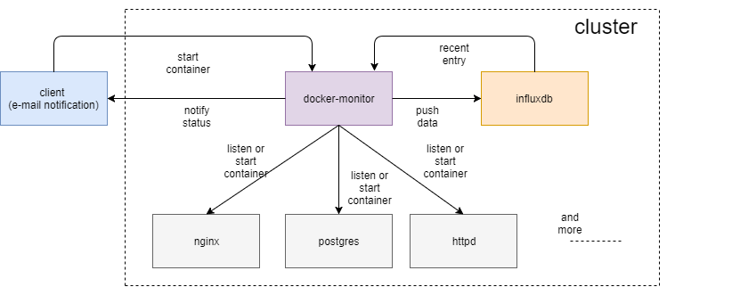

# Docker-monitor
Docker-monitor is a service which alerts user (email) when any container (nginx, postgres and httpd in this case) goes down in the cluster.

----

## Docker-monitor architecture



* docker-monitor: The main service that polls running containers, pushes data to influx and listens for request from client

* influxdb: Time-series database used to store metrics of the containers

----

## Getting started with docker-monitor

1) Checkout the deployment files:
```
git clone https://github.com/hackathon-2K17-CloudConquerors/docker-monitor.git
cd docker-monitor/deployments/docker-compose
```

2) Create the configuration file: (keeping everything by default should be fine)
```
modify entries in config.env
```

3) Start the containers:
```
docker-compose up
```
----

## To Build the project locally

1) Checkout to the root directory:
```
cd docker-monitor
```

2) Package the project
```
make package
```

3) Use docker registry (optional)
```
Change BUILD_NUMBER and DOCKER_REGISTRY in the Makefile
make docker_push
```

----

## Prerequisites

* docker-monitor requires access to the Docker event API socket (`/var/run/docker.sock` by default)
* docker-monitor requires privileged access.
